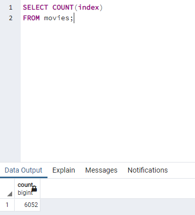
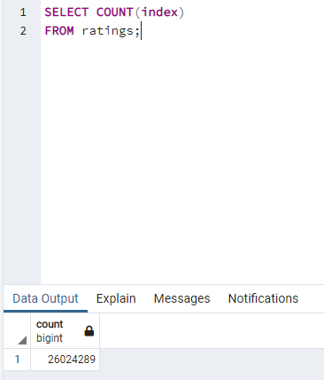

# Movies-ETL

## Overview
Create an automated data pipeline for Amazing Prime. Using the principles of extract, transform, and load (ETL) this project will be able to take in any movie based dataset and put it into a postgreSQL database. This is done by extracting information from [wikipedia.org](https://www.wikipedia.org/) and [kaggle.com](https://www.kaggle.com/), then cleaning the data using regex expression, and finally using sqlalchemy to establish a connection with postgreSQL to import the cleaned data.

## Resources
Data: [movies_metadata.csv](Resources/movies_metadata.csv), [wikipedia-movies.json](Resources/wikipedia-movies.json), and ratings.csv (file too big to import into github)  
Software: PgAdmin 4 6.8, PostgreSQL 11.16, Visual Studio Code 1.69.2, Python 3.7.13, Jupyter Notebook 6.4.8, Anaconda 4.13.0  
Python Libraries: pandas, numpy, sqlalchemy

## Results
Starting with the three data files in two different locations and file types as listed above in the "Data" section, they are imported into into a SQL data with the sizes listed below using the `to_sql` method of the pandas library:

 
> Figure 1 & Figure 2